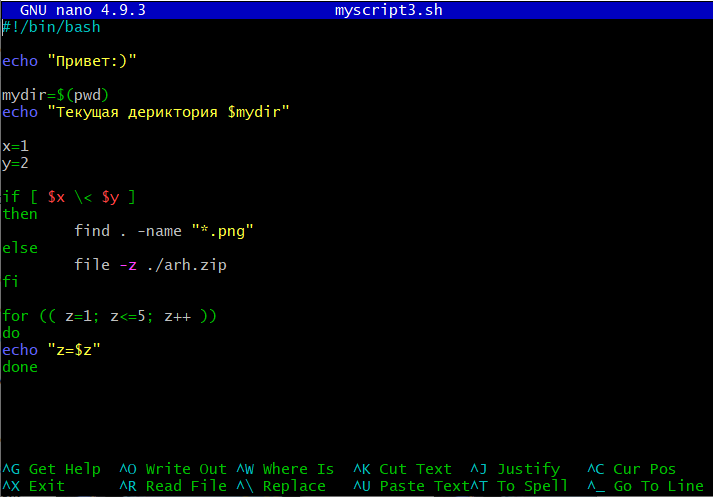
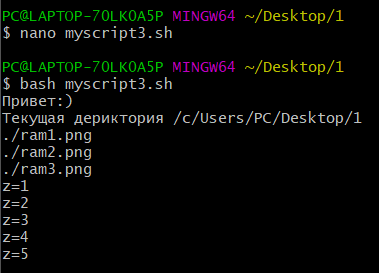

# ENV
# Задание

Реализовать BASH-скрипт с передачей переменных окружения и аргументов и использованием утилит find и file (опционально использование конструкций if и for).
--
Порядок выполнения:
Анализ задачи.
Исследование источников.
Реализация BASH-скрипта.
(опционально) Использовать в скрипте конструкции if и for.

# Выполнение задания

## Вывод скрипта

